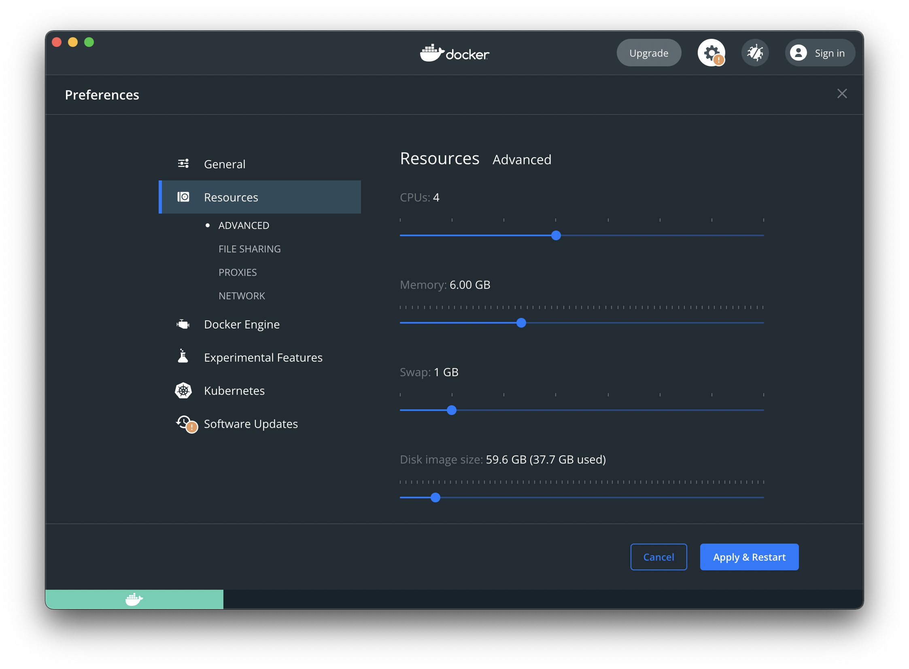

# Install on Docker Desktop

If you have [Docker Desktop](https://www.docker.com/products/docker-desktop/), installing a local Nuvolaris development cluster is very easy.

The most important prerequisite is to reserve al least 6GB of memory to Docker Desktop, since the default is not enough. This is a required step for Mac, but it is not on Windows.



On Mac you should:
- click on the Docker Desktop icon
- select Preferences
- click on Resources 
- *increase the memory up to 6GB* 
- click on `Apply & Restart`

## Download `nuv`

Now you are ready to install Nuvolaris.

Copy the `<url-address>` of the latest version of the installer [from this page](https://github.com/nuvolaris/nuvolaris/releases).

Download and unpack it (replace `<url-address>` with the actual URL address):

```
curl -sL <url-address> | tar xzvf -
install nuv /usr/local/bin/nuv
nuv -v
```

If the download went ok, you should see the version number of the installer.

## Installing Nuvolaris 

Now you can install Nuvolaris on Docker Desktop with 

```
nuv setup --devcluster
```

The installation can take a few minutes to complete, mostly because a number of large Docker images must be downloaded. 

If something goes wrong, please check the [troubleshooting](troubleshooting.md) page.

Once the installation is completed, proceed reading [Apache OpenWhisk documentation](https://openwhisk.apache.org/documentation.html), remembering to use `nuv wsk` when you see `wsk`.


